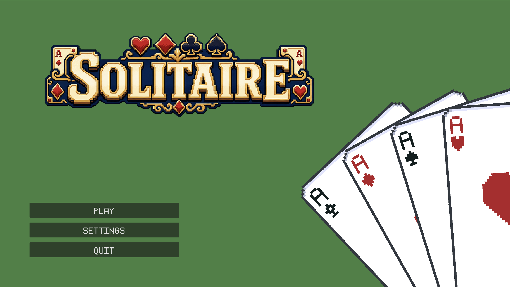
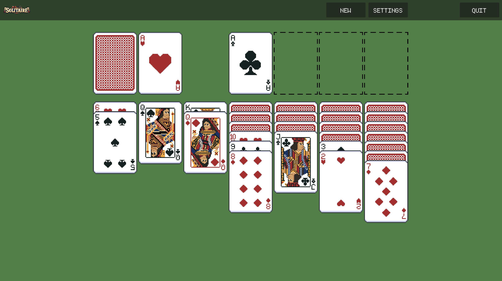

# Building and Shipping My First Game

This project is a small solitaire game built with Godot and published on itch.io. My goal was to complete the entire development cycle: defining a manageable scope, building the core mechanics, polishing the experience, and releasing something other people could play.

## The challenge

Although solitaire has simple rules from a player’s perspective, implementing it required careful management of card state and interactions. The game needed to determine which cards could be moved, identify valid destinations, maintain the correct ordering of each pile, and consistently detect when the player had won.

## My approach

I separated the card data and game rules from their visual representation. This made it easier to reason about moves, update the interface, and debug cases where the displayed cards and underlying game state could otherwise become inconsistent.

I implemented the core systems incrementally:

- Deck creation and shuffling
- Initial card layout
- Card selection and movement
- Validation of legal moves
- Draw and foundation pile behaviour
- Win-condition detection
- Visual and interaction feedback

After the main game loop was working, I focused on usability and polish, including clearer input feedback, layout improvements, and packaging the game for release on itch.io.

## What I learned

The project taught me that finishing a game involves much more than implementing its central mechanic. Small details—such as input handling, visual feedback, resetting the game, and handling unusual player actions—have a significant impact on how complete the result feels.

It also strengthened my understanding of state-driven systems and reinforced the value of keeping game logic separate from presentation. Most importantly, I gained experience taking a personal project beyond the prototype stage and turning it into a publicly released product.
